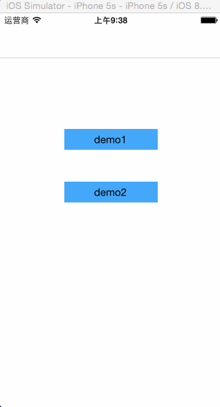

CBChart
=======

generate line chart or bar chart and so on with values

给定x，y轴的值，自动生成折线图；可定制性高；

###使用方法
	
	CBChartView *chartView = [CBChartView charView];
    [self.view addSubview:chartView];
    chartView.xValues = @[@"0",@"9", @"10", @"11", @"12", @"13", @"14", @"15", @"16", @"17"];
    chartView.yValues = @[@"75", @"20", @"90", @"50", @"55", @"60", @"50", @"50", @"34", @"67"];
    

###头文件的属性
	
	/*
 	* x坐标的值和y坐标的值
 	* coordinate values, chart will draw itself on layer
 	* try to value string to xValues' element or yValues' element
 	*/
	@property (strong, nonatomic) NSArray *xValues;
	@property (strong, nonatomic) NSArray *yValues;

	/** 是否需要虚线网格 */
	@property (assign, nonatomic) BOOL isDrawDashLine;
	/** 关闭坐标系动画 */
	@property (assign, nonatomic) BOOL shutDefaultAnimation;
	/** default is 4 (y轴方向的实数个数) */
	@property (assign, nonatomic) int yValueCount;
	/** 函数线条 或者 柱状图的粗细 */
	@property (assign, nonatomic) CGFloat chartWidth;
	/** 颜色 */
	@property (strong, nonatomic) UIColor *chartColor;
	
	/** 图表类型 暂时只支持折线 更多精彩 敬请期待 */
	@property (assign, nonatomic) CBChartType chartType;

---

 